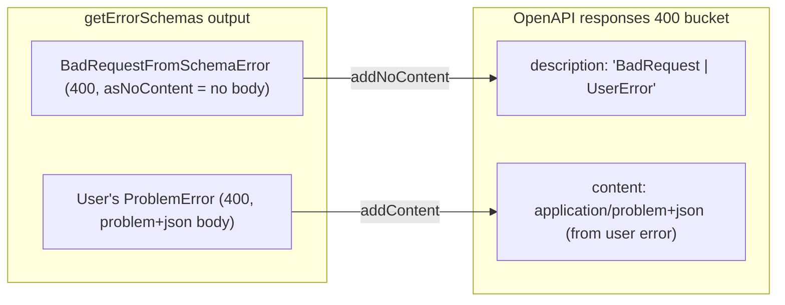

# ProblemJson Redesign -- Effect-Idiomatic RFC 9457

## Analysis of Current Issues

### 1. Non-idiomatic `makeErrorClass` return shape

The current factory returns `{ Error, problem, make }` -- a plain object with three properties. This forces consumers into awkward patterns like `ProblemJson.NotFound.Error`, `ProblemJson.NotFound.make(...)`, and `ProblemJson.NotFound.problem`. In Effect, error classes are standalone classes that you `new` or use directly as schema references (see [HttpApiError.ts](packages/effect-problem-json/.repos/effect/packages/effect/src/unstable/httpapi/HttpApiError.ts)).

### 2. Missing `_tag` field (no `Effect.catchTag` support)

The current error classes have no `_tag: Schema.tag("...")` field. Effect v4's discriminated union system, `Effect.catchTag`, and `Schema.Union` all rely on `_tag` for dispatching. The reference `HttpApiError` classes all use:

```typescript
class BadRequest extends Schema.ErrorClass<BadRequest>("effect/HttpApiError/BadRequest")({
  _tag: Schema.tag("BadRequest")
}, { httpApiStatus: 400 })
```

### 3. No `Respondable` protocol implementation

Effect v4's error-to-response flow uses `HttpServerRespondable.symbol`. When an error implements this protocol, the framework can automatically convert it to an HTTP response. The current code ignores this entirely and instead relies on a heavyweight middleware to catch and transform errors after the fact.

In the reference codebase each error class implements:

```typescript
[HttpServerRespondable.symbol]() {
  return Effect.succeed(someResponse)
}
```

This means errors **know how to become responses** -- the framework doesn't need a middleware to rewrite them.

### 4. Middleware is too complex but still necessary

The current `middleware()` has three defense layers:
- `Effect.catchIf` for SchemaErrors
- `transformResponse` to rewrite 4xx response bytes
- `catchDefect` for errors promoted to defects

With `Respondable`, user-declared errors no longer need the middleware. However, after deep investigation of the framework, **two of the three layers are still required** due to framework-level constraints that cannot be worked around:

1. **Empty-body 400 rewriting**: `HttpApiBuilder` hardcodes `BadRequestFromSchemaError` (which is `asNoContent`) into every endpoint's error union via `getErrorSchemas()`. When payload schema validation fails, the framework encodes it as `Response.empty({ status: 400 })`. There is no public API to replace or remove this. The middleware must rewrite these empty 400 responses to problem+json.

2. **Defect catching**: `HttpServerError.causeResponse` produces `Response.empty({ status: 500 })` for unhandled defects. There is no framework hook to customize defect-to-response conversion. Middleware `catchDefect` is the correct extension point.

What CAN be simplified: the `transformResponse` function currently parses JSON bytes from response bodies and inspects `_tag`/`message` fields. This is unnecessary -- we only need to detect empty-body error responses (`body._tag === 'Empty' && status >= 400`), not parse already-serialized JSON.

### 5. String-parsing of error messages (`parseSchemaErrors`)

The code comments themselves acknowledge this is fragile:

> *"This string parser only activates for responses that are already rendered as application/json... It is fragile against Effect error-message format changes."*

The structured `formatSchemaIssues` (using `SchemaIssue.makeFormatterStandardSchemaV1`) is already the right approach. The string parser should be removed entirely.

### 6. Raw byte inspection in `transformResponse`

Decoding `Uint8Array` bodies, parsing JSON, inspecting `_tag` and `message` fields -- this reverse-engineers what the framework produced. With `Respondable`, the error produces the correct response from the start.

### 7. OpenAPI spec post-processing is still needed (but should use OpenApi.Transform)

My original analysis that "just annotate schemas and OpenAPI works" was **wrong**. After investigating the framework:

- `getErrorSchemas()` unconditionally appends `BadRequestFromSchemaError` to every endpoint (line 184 of `HttpApiEndpoint.ts`). There is **no public API** to remove it.
- `BadRequestFromSchemaError` is `asNoContent` with `httpApiStatus: 400`, so it adds a "BadRequest" description with **no content block** to the `responses["400"]` bucket in OpenAPI.
- For endpoints where we declare our own problem+json 400 error, the spec merges them: our content schema is correct, but the description includes "BadRequest" from the framework's error.
- For endpoints with **no** user-declared 400, the spec shows an empty-body "BadRequest" 400 -- which is wrong since our middleware actually returns problem+json.

The current `openApiTransform` function addresses this but should be refactored to use the framework's `OpenApi.Transform` annotation (a first-class API for spec post-processing) rather than being applied manually after the fact.

### 8. Missing `ErrorReporter.ignore`

Effect v4 uses `ErrorReporter.ignore` on expected API errors so they don't pollute logs. The current implementation doesn't set this.

---

## Proposed Architecture

### Core design principle: **Errors as self-describing, Respondable schema classes**

```mermaid
flowchart TD
    subgraph userCode [User Code]
        A["class TodoNotFound extends ProblemError(\"TodoNotFound\", 404)({...}) {}"]
    end

    subgraph builtIn [Built-in Convenience]
        B["ProblemDetail.NotFound"]
        C["ProblemDetail.BadRequest"]
    end

    subgraph framework [Effect Framework Integration]
        D["Schema.ErrorClass"]
        E["Respondable protocol"]
        F["httpApiStatus annotation"]
        G["asJson contentType annotation"]
    end

    subgraph runtime [Runtime Behavior]
        H["Handler fails with TodoNotFound"]
        I["HttpApiBuilder encodes via error schema"]
        J["application/problem+json response"]
    end

    A --> D
    A --> E
    A --> F
    A --> G
    B --> D
    C --> D
    H --> I
    I --> J
```

### A. `ProblemError` -- error class factory (replaces `makeErrorClass`)

A curried factory matching Effect's class factory pattern:

```typescript
export function ProblemError<Tag extends string, Status extends StatusCode>(
  tag: Tag,
  status: Status
) {
  return <Fields extends Schema.Struct.Fields>(
    extensions?: Fields
  ): ProblemErrorClass<Tag, Status, Fields> => {
    // implementation
  }
}
```

**Usage mirrors Effect's own patterns:**

```typescript
class TodoNotFound extends ProblemError("TodoNotFound", 404)({
  todoId: Schema.Number,
}) {}

// Direct construction (like any Schema.ErrorClass)
const err = new TodoNotFound({ detail: "Todo 42 not found", todoId: 42 })

// Use as endpoint error schema directly (no .problem indirection)
HttpApiEndpoint.get("getTodo", "/todos/:id", {
  error: TodoNotFound,  // already has problem+json encoding
})
```

Each generated class will:
- Extend `Schema.ErrorClass` with `_tag: Schema.tag(tag)`
- Include RFC 9457 base fields: `type`, `title`, `status`, `detail`, `instance`
- Apply `HttpApiSchema.asJson({ contentType: "application/problem+json" })`
- Set `httpApiStatus: status` annotation
- Implement `[HttpServerRespondable.symbol]()` returning a `application/problem+json` response
- Set `[ErrorReporter.ignore] = true`
- Provide constructor defaults for `type` (about:blank), `title` (derived from status), `status` (the literal)

### B. Built-in error classes (replaces the `{ Error, problem, make }` objects)

```typescript
export class BadRequest extends ProblemError("BadRequest", 400)() {}
export class NotFound extends ProblemError("NotFound", 404)() {}
export class Conflict extends ProblemError("Conflict", 409)() {}
// ... etc
```

These are now proper classes, not `{ Error, problem, make }` triples. Usage:

```typescript
// Before (current)
Effect.fail(ProblemJson.NotFound.make({ detail: "..." }))
error: ProblemJson.NotFound.problem

// After (proposed)
Effect.fail(new ProblemDetail.NotFound({ detail: "..." }))
error: ProblemDetail.NotFound
```

### C. `ValidationProblem` -- structured validation error (replaces `fromSchemaError` + `parseSchemaErrors`)

A dedicated error class for schema validation failures:

```typescript
export class ValidationProblem extends ProblemError("ValidationProblem", 400)({
  errors: Schema.Array(Schema.Struct({
    detail: Schema.String,
    pointer: Schema.optional(Schema.String),
  })),
}) {
  static fromSchemaError(error: Schema.SchemaError): ValidationProblem {
    const issues = formatSchemaIssues(error)
    return new ValidationProblem({
      detail: "The request did not match the expected schema",
      errors: issues,
    })
  }
}
```

This replaces:
- `fromSchemaError` (ad-hoc response builder) -- now it's a proper error class method
- `parseSchemaErrors` (fragile string parser) -- removed entirely
- `ValidationError` type + `ValidationErrorItem` schema -- folded into the class

### D. Streamlined middleware (3 layers, but much simpler)

The middleware keeps 3 layers but each is simplified. The key insight: user-declared `ProblemError` classes now implement `Respondable`, so they produce correct responses natively. The middleware only handles **framework-generated** errors.

```typescript
export function middleware(options?: { readonly typePrefix?: string }) {
  const prefix = options?.typePrefix ?? '/problems/'

  // Pre-built safe 500 response (no implementation details leaked)
  const safeServerError = HttpServerResponse.jsonUnsafe(
    {
      type: `${prefix}internal-server-error`,
      title: 'Internal Server Error',
      status: 500,
      detail: 'An unexpected error occurred',
    },
    { status: 500, contentType: 'application/problem+json' },
  )

  return HttpRouter.middleware<{ provides: never; handles: Schema.SchemaError }>()(
    (httpEffect) =>
      httpEffect.pipe(
        // Layer 1: Catch SchemaErrors in error channel (non-HttpApi routes only;
        // HttpApi routes catch these internally via encodeError)
        Effect.catchIf(Schema.isSchemaError, (error) =>
          Effect.succeed(ValidationProblem.toResponse(error))
        ),
        // Layer 2: Rewrite empty-body error responses to problem+json.
        // This handles HttpApi's BadRequestFromSchemaError (asNoContent -> empty 400)
        // and any other empty error responses from the framework.
        // NO JSON parsing, NO byte inspection -- just check body._tag === 'Empty'
        Effect.map((response) => {
          if (response.body._tag === 'Empty' && response.status >= 400) {
            return makeProblemResponse(response.status, { typePrefix: prefix })
          }
          return response
        }),
        // Layer 3: Catch defects -- 500 with no details
        Effect.catchDefect(() => Effect.succeed(safeServerError)),
      ),
    { global: true },
  )
}
```

**What was removed**: JSON byte parsing, `_tag`/`message` field inspection, string-based error message parsing. The `transformResponse` function is replaced by a 4-line empty-body check.

### E. OpenAPI transform (kept, but improved)

The `openApiTransform` function is **kept** because the framework unconditionally adds `BadRequestFromSchemaError` to every endpoint's error union (hardcoded in `getErrorSchemas` at line 184 of `HttpApiEndpoint.ts`). There is no public API to remove it.

**Improvements**:
- Designed to work with `OpenApi.Transform` annotation (the framework's first-class spec post-processing API):

```typescript
const api = HttpApi.make('MyApi')
  .add(myGroup)
  .annotate(OpenApi.Transform, ProblemDetail.openApiTransform)
```

- The transform rewrites all error responses to show the problem+json schema with the correct `application/problem+json` content type
- Replaces the built-in `BadRequestFromSchemaError` schema with the proper RFC 9457 structure
- A dedicated **test** validates the generated OpenAPI spec shows ONLY problem+json errors

### F. OpenAPI spec test

A new test generates the OpenAPI spec programmatically using `OpenApi.fromApi(api)` and validates:

```typescript
it('generated OpenAPI shows only problem+json for 400 errors', () => {
  const api = HttpApi.make('TestApi')
    .add(testGroup)
    .annotate(OpenApi.Transform, ProblemDetail.openApiTransform)
  
  const spec = OpenApi.fromApi(api)
  
  // 400 response uses problem+json content type, not application/json
  const r400 = spec.paths['/test'].post.responses['400']
  expect(r400.content['application/problem+json']).toBeDefined()
  expect(r400.content['application/json']).toBeUndefined()
  
  // Schema matches RFC 9457 structure
  const schema = r400.content['application/problem+json'].schema
  expect(schema.properties).toHaveProperty('type')
  expect(schema.properties).toHaveProperty('title')
  expect(schema.properties).toHaveProperty('status')
  expect(schema.properties).toHaveProperty('detail')
  
  // No raw Effect SchemaError schema present
  expect(spec.components.schemas).not.toHaveProperty('effect_HttpApiSchemaError')
})
```

### G. Module rename consideration

For merge-readiness into core Effect, the module should be named `HttpApiProblemDetail` (matching the RFC 9457 terminology "Problem Details") rather than `ProblemJson`. The export namespace would be:

```typescript
import { HttpApiProblemDetail } from "@ballatech/effect-problem-json"
// or eventually:
import { HttpApiProblemDetail } from "effect/unstable/httpapi"
```

---

## API Surface Comparison

### Current API

- `statusTitles` / `StatusCode` -- lookup table
- `Extensions` -- type alias
- `errorFields(status)` -- returns schema fields object
- `asProblemJson(schema)` -- sets content type annotation
- `makeErrorClass(tag, status, extensions?)` -- returns `{ Error, problem, make }`
- `makeResponse(status, detail, options?)` -- creates ad-hoc `HttpServerResponse`
- `ValidationError` / `ValidationErrorItem` -- types/schemas
- `formatSchemaIssues(error)` -- structured formatter
- `fromSchemaError(error, options?)` -- creates `HttpServerResponse` from schema error
- `parseSchemaErrors(message)` -- string parser (fragile)
- `transformResponse(response, options?)` -- rewrites 4xx responses
- `middleware(options?)` -- 3-layer global middleware
- `openApiTransform(spec)` -- OpenAPI spec rewriter
- 15 pre-built `{ Error, problem, make }` objects

### Proposed API

- `statusTitles` / `StatusCode` -- keep (utility)
- `ProblemError(tag, status)(extensions?)` -- class factory (replaces `makeErrorClass`, `errorFields`, `asProblemJson`)
- `formatSchemaIssues(error)` -- keep (stable, uses standard v1 formatter)
- `ValidationProblem` -- error class with `.fromSchemaError()` and `.toResponse()` (replaces `fromSchemaError`, `parseSchemaErrors`, `ValidationError`, `ValidationErrorItem`)
- `makeResponse(status, detail, options?)` -- keep for non-HttpApi use cases
- `middleware(options?)` -- streamlined 3-layer: catchIf + empty-body rewrite + catchDefect
- `openApiTransform(spec)` -- improved, works with `OpenApi.Transform` annotation
- 15 pre-built **classes** (not objects)

### Removed

- `parseSchemaErrors` -- fragile string parser, no longer needed
- `transformResponse` -- replaced by 4-line empty-body check inside middleware
- `Extensions` type -- replaced by typed schema fields on each class
- `errorFields` -- internalized into `ProblemError`
- `asProblemJson` -- internalized into `ProblemError`

---

## Breaking Changes

This is a **major** redesign. Consumer code changes from:

```typescript
// Before
const TodoNotFound = ProblemJson.makeErrorClass("TodoNotFound", 404)
Effect.fail(TodoNotFound.make({ detail: "..." }))
error: TodoNotFound.problem

// After
class TodoNotFound extends ProblemDetail.NotFound({ todoId: Schema.Number }) {}
// or
class TodoNotFound extends ProblemError("TodoNotFound", 404)({ todoId: Schema.Number }) {}
Effect.fail(new TodoNotFound({ detail: "...", todoId: 42 }))
error: TodoNotFound
```

Pre-built errors change from `ProblemJson.NotFound.make(...)` to `new ProblemDetail.NotFound(...)`.

---

---

## Addressing the Two Framework Constraints

### Constraint 1: OpenAPI shows both error schemas for 400

**Root cause** (confirmed by source analysis):

`HttpApiEndpoint.getErrorSchemas()` (line 184) always appends `BadRequestFromSchemaError` to every endpoint's error set. This is hardcoded:

```typescript
// HttpApiEndpoint.ts:184
return Arr.append(Array.from(schemas), BadRequestFromSchemaError)
```

There is no option, annotation, or API to suppress this.

**How it manifests in OpenAPI**:



Because `BadRequestFromSchemaError` is `asNoContent`, it adds only a **description** (no content block) to the 400 bucket. If we also declare a problem+json 400 error, the content is correct but the description is polluted. If we declare **no** user 400 error, the spec shows an empty-body 400 -- wrong since our middleware produces problem+json.

**Solution**: Keep `openApiTransform` but make it work as an `OpenApi.Transform` annotation. The transform:
1. Replaces the `BadRequestFromSchemaError` component schema with our RFC 9457 schema
2. Swaps `application/json` content type to `application/problem+json` on 400 responses
3. Cleans up merged descriptions

**Test**: A new test generates the spec via `OpenApi.fromApi(api)` and asserts:
- 400 responses have `application/problem+json` content type
- No `application/json` on 400 responses
- The schema structure matches RFC 9457 (type, title, status, detail, errors)
- No raw Effect schema error schema names in components

### Constraint 2: Defects must produce 500 problem+json with no details

**Root cause** (confirmed by source analysis):

`HttpServerError.causeResponse()` produces `Response.empty({ status: 500 })` for Die reasons:

```typescript
// HttpServerError.ts:275
const internalServerError = Response.empty({ status: 500 })
```

`HttpEffect.toHandled()` uses `causeResponse` as the global error boundary. There is no hook to customize defect-to-response conversion at the framework level.

**Solution**: The middleware's `Effect.catchDefect` layer is the correct and intended extension point. It produces:

```json
{
  "type": "/problems/internal-server-error",
  "title": "Internal Server Error",
  "status": 500,
  "detail": "An unexpected error occurred"
}
```

No stack traces, no error messages, no implementation details. The response is pre-built (not constructed per-request) so it cannot accidentally leak information.

**Important subtlety**: The `catchDefect` intercepts defects BEFORE `causeResponse` runs, because the middleware wraps the router's `asHttpEffect()` which runs before `HttpEffect.toHandled`. So the defect never reaches the framework's empty-500 fallback.

**Test** (already exists in lambda tests, will be strengthened):

```typescript
it('catches unhandled defects and returns 500 problem+json with no details', async () => {
  const result = await invoke(handlerWithMiddleware, 'GET', '/items/crash')
  
  expect(result.statusCode).toBe(500)
  expect(result.contentType).toContain('application/problem+json')
  expect(result.body).toMatchObject({
    type: expect.stringContaining('internal-server-error'),
    title: 'Internal Server Error',
    status: 500,
    detail: 'An unexpected error occurred',
  })
  // Must NOT contain implementation details
  expect(result.rawBody).not.toContain('Unexpected failure')
  expect(result.rawBody).not.toContain('stack')
})
```

---

## File Changes

- **[`packages/effect-problem-json/src/ProblemJson.ts`](packages/effect-problem-json/src/ProblemJson.ts)** -- rewrite with new architecture
- **[`packages/effect-problem-json/src/index.ts`](packages/effect-problem-json/src/index.ts)** -- update export (possibly rename to `ProblemDetail` or `HttpApiProblemDetail`)
- **[`packages/effect-problem-json/test/ProblemJson.test.ts`](packages/effect-problem-json/test/ProblemJson.test.ts)** -- rewrite tests for new API, add OpenAPI spec test
- **[`packages/effect-problem-json/test/ProblemJson.lambda.test.ts`](packages/effect-problem-json/test/ProblemJson.lambda.test.ts)** -- update integration tests, strengthen defect test
- **[`packages/effect-problem-json/dev/server.ts`](packages/effect-problem-json/dev/server.ts)** -- update example
- **[`packages/effect-problem-json/README.md`](packages/effect-problem-json/README.md)** -- update docs
